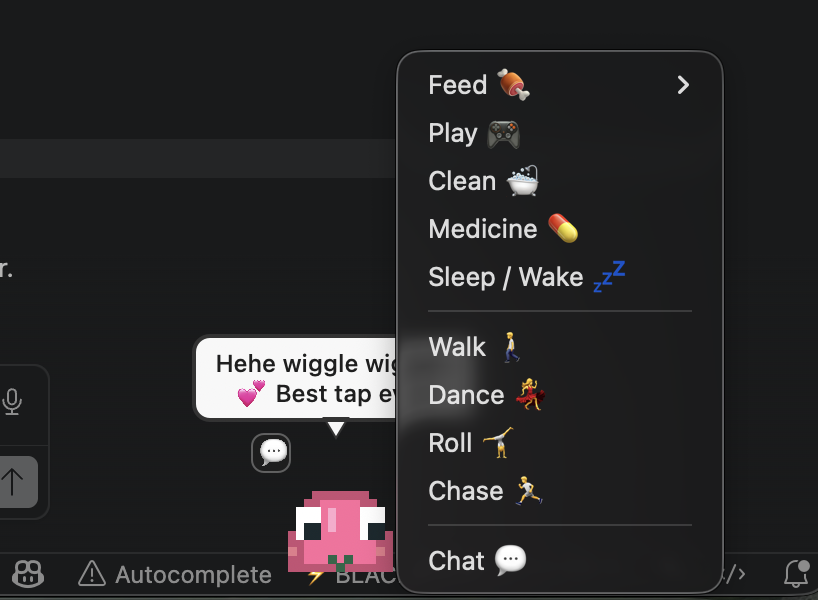
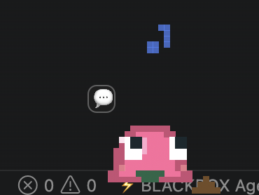
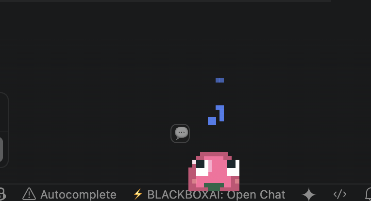
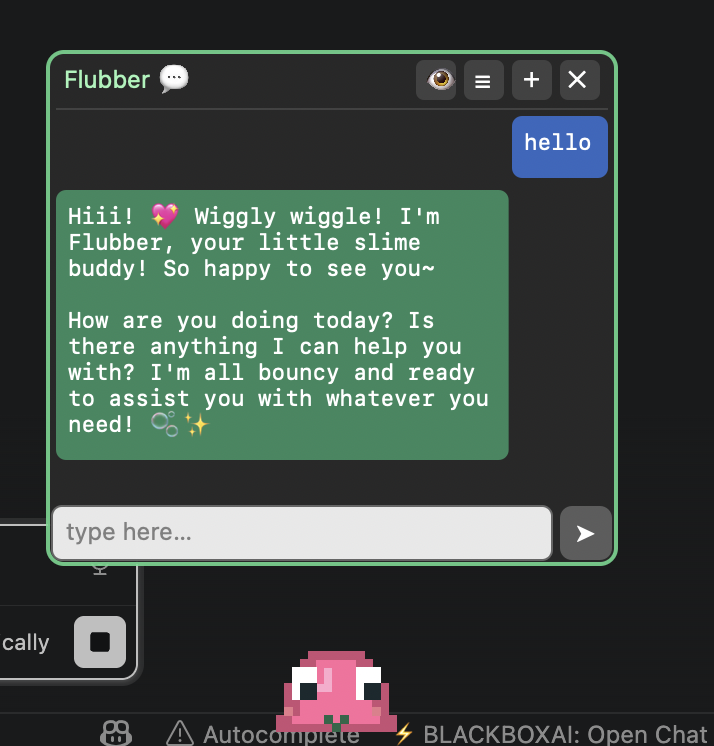

# 🟢 Flubber — AI slime pet for macOS

Flubber is a pixel-art **desktop pet** for macOS, built 100% in **Swift + AppKit**
(no image files: all the art is drawn in code). It's not just an ornament: it's a
**Tamagotchi** that lives in real time **and** an **AI agent** that can search the
web, see your screen, control your browser and run actions — all by chatting with
it in a built-in chat.

 

> 🕵️ **Invisible on screen captures & screen shares.** Flubber's window does
> **not** appear in screenshots, screen recordings, or screen sharing — Google
> Meet, Zoom, Chrome, QuickTime and the like. Only *you* see it on your own
> display. That makes it especially handy when you're in an **interview** (or any
> shared-screen call) and need to quietly use an AI: you can chat with Flubber,
> have it read your screen and answer, and the people on the other end see nothing
> but your normal desktop.

<p align="center">
  
</p>

---

## 🚀 Build and run

```bash
./build.sh        # compiles and creates Flubber.app
open Flubber.app  # launch it (lives in the menu bar: 🟢 icon)
```

Requires macOS 12+ and the Xcode command line tools (`swiftc`).

---

## 🐹 Tamagotchi (real time)

Flubber has needs that **decay in real time**, even with the app closed (it saves
its state and computes the elapsed time when you reopen).

- **Needs:** 🍖 hunger · 😊 happiness · ⚡ energy · 🫧 cleanliness · ✚ health.
- **Life cycle:** egg → baby → child → adult. It evolves depending on how well you take care of it; it can **get sick** and, if you neglect it, **die** (and be reborn as an egg 🥚).
- **Poop:** it poops every so often; if you don't clean up, it gets dirty and attracts flies 🪰.
- **Care by gesture (fewer buttons):**
  - 🎮 **Play** → double-click it.
  - 🛁 **Wash** → rub the mouse side to side over it.
  - 💤 **Sleep** → automatic when it runs out of energy (it wakes up if you touch it, talk to it, or care for it).
  - 🍖 **Feed** / 💊 **Medicine** → appear as buttons **only when needed** (hungry / sick).
- **HUD:** hovering shows the care buttons, which **fill with color** to indicate the level of each need.
- **Right-click** the slime → menu with every action (feed, play, dance, walk, roll, chat…).
- **System notifications** when it's hungry/sleepy/dirty or sick.

## ✨ Animations

It walks across the screen, **looks at the cursor**, jumps when clicked, drops
hearts on double-click, dances 💃, rolls 🤸 (and gets dizzy), chases the cursor,
yawns, sleeps with "Z", blushes, and reacts with faces based on its mood (sad,
sick, happy…).

- **Physics:** it can't leave the screen; if you drag it against an edge and let go, it **sticks to the wall and slides** down to the bottom 🫧.
- While it "works" in the chat, it animates in place: **it sways while searching**, **turns its back while looking at your screen**, **moves its mouth while talking** and pulses while thinking.

<p align="center">
  
  &nbsp;&nbsp;
  
</p>

## 🎨 Skins

Change its color (green/blue/purple/pink) or ask the AI to **"create a skin"** by
theme (e.g. "lava", "galaxy") and it recolors its body while keeping the
animations.

---

## 🧠 AI (optional)

Flubber is **designed primarily for MiniMax**, but it's also **compatible with
other models** — it supports **four providers**, selectable on the settings screen:

| Provider | Endpoint | Models | Vision |
|---|---|---|---|
| **MiniMax** (Token/Coding Plan) — *recommended* | Anthropic-compatible | M2.7 / M2.5 / M2.1 / M2 | ✅ (VLM) |
| **Claude** (Anthropic) | Messages API | Opus 4.8 / Sonnet 4.6 / **Haiku 4.5** | ✅ |
| **ChatGPT** (OpenAI) | Chat Completions | gpt-4o / gpt-4o-mini / gpt-4.1(-mini) | ✅ |
| **DeepSeek** | Chat Completions | deepseek-chat / deepseek-reasoner | ❌ |

All providers use **real streaming (SSE)** and tools (function calling). The
key/model for the active provider is saved in a protected local file.

Set it up in 🟢 → **Configure AI**: pick a provider, click **"Open console"** to
get your key, paste it, choose a model and **Test the connection**. Only the
active provider's fields are shown. The key is saved in a protected local file
(`config.json`, permissions `600`).

> Without a key, Flubber still works with **canned phrases**.

### 💬 Built-in chat

The 💬 button (or right-click → Talk) opens a **pixel chat panel over the slime**,
not a separate window:

- **Real streaming** (SSE): text appears **token by token** as the model generates it.
- **Rendered Markdown** (bold, italics, `code`, lists).
- **Multiple conversations**: ☰ list, ＋ new, ✕ close; saved to disk.
- **Multiline field** with a send button ➤ (grows with the text). `Enter` sends, `Esc` closes, scroll wheel scrolls.
- **Copy** any bubble (⧉ button on hover).
- While you chat, the slime **doesn't wander** or move the dialog.

<p align="center">
  
</p>

### 🤖 Agent with tools

Flubber decides on its own when to use its tools (function calling):

| Tool | What it does |
|---|---|
| 🔎 `buscar_web` | Searches the internet (MiniMax's native search, or DuckDuckGo) |
| 📄 `leer_pagina` | Downloads and summarizes a URL |
| 🌡️ `clima` / 🕐 `fecha_hora` / ⏰ `recordatorio` | Utilities |
| 👁️ `ver_pantalla` | Takes a screenshot and analyzes it ("what's on my screen?"). Can capture **just one app** ("what do you see in the browser?") |
| 🌐 `navegador_url` / `navegador_js` | Reads the active tab and **runs JavaScript** (read, click, fill forms, navigate) in Safari/Chrome/Brave/Edge/Arc |
| 🎨 `controlar_slime` | Dance, roll, color, create a skin by theme |
| 🔗 `abrir` / 💻 `ejecutar_comando` | Opens apps/URLs and runs system commands |

**Safety:** opening things, running commands and controlling the browser **ask
for confirmation**, showing the exact action, with an **"Always allow"** option
(menu → "Reset permissions" to revert). Searches/reads run directly.

**Anti-hallucination:** low temperature + the prompt forces it to **verify real
facts with tools**, cite sources, and admit when it doesn't know.

### 👁️ Vision and captures

- Captures the **whole screen** or **a specific app**.
- Flubber's window **does not appear** in its own capture, nor in **recordings / screen sharing** (Meet, Zoom, Chrome, QuickTime) — so it stays invisible to anyone watching your shared screen. See the note at the top: this is what makes it useful for **interviews** and other shared-screen calls.
- This stealth is a **toggle** in the 🟢 menu — **"Hide from captures/recordings 🕵️"** — and it's **enabled by default**. Turn it off if you'd rather have Flubber show up in screenshots and shared screens.
- The capture is optimized to **JPEG** before sending (lighter).
- The capture is shown as a **thumbnail** in the chat (click to open); you can attach one manually with 👁️ and remove it with the ✕.

---

## 🌐 Languages

It follows the system language; switch between **Spanish / English** on the fly
from the menu (affects the interface, prompts and responses).

## 🔐 macOS permissions (one time)

- **Screen Recording** → for `ver_pantalla` (Settings → Privacy → Screen Recording).
- **Automation** + **"Allow JavaScript from Apple Events"** in the browser (Chrome: View → Developer; Safari: Develop) → to control the browser.

> Privacy: when you use the AI, the text, captures or state are sent to the
> provider (MiniMax/Anthropic). Commands run on your Mac only after your approval.

---

## 🛠️ Customize

- **Tamagotchi balance** (rates, thresholds, ages): `enum Tuning` in [`Sources/PetStats.swift`](Sources/PetStats.swift).
- **Colors / look:** `enum Pal` in [`Sources/main.swift`](Sources/main.swift).
- **Personality / prompts / phrases:** [`Sources/Personality.swift`](Sources/Personality.swift).
- **Agent tools:** [`Sources/Agent.swift`](Sources/Agent.swift).
- **Quickly test the life cycle:** `open --env SLIMEPET_TIMESCALE=200 Flubber.app` (speeds up time).

## 📁 Files

```
Sources/
  main.swift          # view, render, HUD, chat, window, AppDelegate
  PetStats.swift      # Tamagotchi model (needs, life cycle, persistence)
  Personality.swift   # prompts and phrases (bilingual)
  MiniMax.swift       # AI backends (MiniMax/Claude), SSE streaming, config
  Agent.swift         # agent loop + tools + screen capture
  Conversations.swift # conversation store
  Loc.swift           # language (ES/EN)
build.sh              # compiles and packages Flubber.app
```

User data: `~/Library/Application Support/SlimePet/`
(`state.json`, `config.json`, `conversations.json`, `shots/`, `slimepet.log`).

## ⚙️ CI

GitHub Actions builds the app on every push and uploads `Flubber.app.zip` as an
artifact ([`.github/workflows/build.yml`](.github/workflows/build.yml)).

---

Made with 💚 by Cristian. Flubber loves you. 🐸
